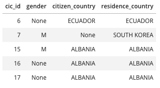

# Udacity Data Engineer Nanodegree - Capstone Project

## Project Summary

Hello, this is my final project as part of the Udacity Data Engineering Nanodegree course. The goal of this project is
to create a data lake that integrate U.S. immigration data in April 2016 with the demographic and airport data in U.S.
so that they can be analyzed together to get some meaningful insights. Thus, we utilize the star schema that consist of
the immigration fact table and multiple other dimension tables which will discuss later.

## Data sources

| Data Set                                                                                                     | Format | Description                                                                                                                                                                                                  |
|--------------------------------------------------------------------------------------------------------------|--------|--------------------------------------------------------------------------------------------------------------------------------------------------------------------------------------------------------------|
| [I94 Immigration Data](https://travel.trade.gov/research/reports/i94/historical/2016.html)                   | SAS    | Data contains international visitor arrival statistics from the US National Tourism and Trade Office                                                                                                         |
| [World Temperature Data](https://www.kaggle.com/berkeleyearth/climate-change-earth-surface-temperature-data) | CSV    | This dataset is from Kaggle and contains monthly average temperature data at different country in the world wide. However, this dataset only contains data up to 2015, so it isn't feasible for this project |
| [U.S. City Demographic Data](https://public.opendatasoft.com/explore/dataset/us-cities-demographics/export/) | CSV    | This dataset is from OpenSoft and contains information about the demographics of all U.S. cities and census-designated places with a population greater than 65,000                                          |
| [Airport Code Data](https://datahub.io/core/airport-codes#data)                                              | CSV    | This dataset is from ourairports which contains table of airport codes, corresponding cities and other descriptions the identify the airport.                                                                |

## Tools & technologies choice

- **AWS S3**: For data lake storage since this is a storage service after all, it can store large object. and easily
  accessible by other AWS services.
- **Python**: For data exploration and performing ETL processing from data sources to S3
    - **Pandas**: For data exploration on the sample data since it's a commonly used package that integrate nicely with
      other Python visualization packages.
    - **PySpark**: For performing ETL because most of these datasets are large in size and Spark provided fast in-memory
      processing that support file in tabular format and can even perform SQL queries on them. Also, the library
      .sas7bdat was used for reading SAS data is automatically inferred from metadata embedded in the SAS file.

## Project steps

- Read ```I94_SAS_Labels_Descriptions.SAS``` file to get the mapping of country, city and states in U.S. from code to
  name. And save the data as a parquet file to S3.
- Read ```airport-codes_csv.csv``` file and only select distinct column, then selecting only airports in U.S., since we
  only interested about the immigration to U.S. And save the data as a parquet file to S3.
- Read ```us-cities-demographics.csv``` and save the data as a parquet file to S3 partitioning by state.
- Read the immigration data and save the data as a parquet file to S3 partitioning by year and month.
- In each stage, before saving data to S3, we also perform data quality check to ensure the the number of records are
  greater than zero and the primary key of each table is unique.
- Data lake is now ready to be used. We can now use Spark to read and perform analysis as pleased.

## Data dictionary

This analytic data lake contains 6 following tables:

### Fact table

1. ```immigration```

| Field Name        | Data type | Description                                                       |
|-------------------|-----------|-------------------------------------------------------------------|
| immigrant_id      | INT       | Primary Key                                                       |
| cic_id            | INT       | CIC ID                                                            |
| gender            | STRING    | Gender                                                            |
| occupation        | STRING    | Occupation                                                        |
| year              | INT       | Year                                                              |
| month             | INT       | Month                                                             |
| citizen_country   | INT       | Birth country code. This is a FK to the ```countries``` table     |
| residence_country | INT       | Residence country code. This is a FK to the ```countries``` table |
| city_code         | STRING    | 3 digit city code. This is a FK to the ```cities``` table         |
| state_code        | STRING    | 3 digits state code. This is a FK to the ```states``` table       |
| mode              | INT       | Transportation method (1=Air; 2=Sea; 3=Land; 9=Not reported)      |
| visa              | INT       | Visa category (1=Business; 2=Pleasure; 3=Student)                 |
| visa_type         | STRING    | Visa type                                                         |
| visa_post         | STRING    | Visa issued department                                            |
| admin_num         | DOUBLE    | Admission Number                                                  |
| arrival_date      | DATE      | Arrival date                                                      |
| departure_date    | DATE      | Leaving date from U.S.                                            |
| age               | STRING    | Age of respondent                                                 |
| airline           | STRING    | Airline                                                           |
| flight_num        | STRING    | Flight Number                                                     |

### Dimension tables

2. ```airports```

| Field Name   | Data type | Constraint  |
|--------------|-----------|-------------|
| airport_id   | STRING    | Primary Key |
| type         | STRING    | -           |
| name         | STRING    | -           |
| elevation_ft | INT       | -           |
| continent    | STRING    | -           |
| iso_country  | STRING    | -           |
| state_code   | STRING    | -           |
| municipality | STRING    | -           |
| gps_code     | STRING    | -           |
| latitude     | DOUBLE    | -           |
| longitude    | DOUBLE    | -           |

3. ```demographic```

| Field Name             | Data type | Constraint  |
|------------------------|-----------|-------------|
| demographic_id         | INT       | Primary Key |
| city                   | STRING    | -           |
| state                  | STRING    | -           |
| median_age             | DOUBLE    | -           |
| male_population        | INT       | -           |
| female_population      | INT       | -           |
| total_population       | INT       | -           |
| number_of_veterans     | INT       | -           |
| foreign_born           | INT       | -           |
| average_household_size | DOUBLE    | -           |
| state_code             | STRING    | -           |
| race                   | STRING    | -           |
| count                  | INT       | -           |

4. ```cities```

| Field Name | Data type | Constraint  |
|------------|-----------|-------------|
| city_code  | STRING    | Primary Key |
| city       | STRING    | -           |

5. ```countries```

| Field Name   | Data type | Constraint  |
|--------------|-----------|-------------|
| country_code | INT       | Primary Key |
| country      | STRING    | -           |

6. ```states```

| Field Name | Data type | Constraint  |
|------------|-----------|-------------|
| state_code | STRING    | Primary Key |
| state      | STRING    | -           |

This design is similar to what call "Star-schema", where the `immigration` is the fact table that contain 'fact' about
immigrant travel or move to U.S. And the rest of the tables are dimension tables that contains additional information
that move in fact table. i.e., `demographics` table contains supplement details about the city the immigrant decided to
move to. And the `cities`, `countries` and `states` tables contains the full names in those respective table name.

This schema might be denormalized the data a bit, but it help simplify query and improve query performance.

## Sample usage & queries

Read all tables using PySpark and create temporary view of those tables to perform SQL queries.

```python
df_immi = spark.read.parquet("s3a://[S3 BUCKET]/immigration/*/*/*.parquet")
df_immi.createOrReplaceTempView("immigration")

df_demog = spark.read.parquet("s3a://[S3 BUCKET]/demographic/*/*.parquet")
df_demog.createOrReplaceTempView("demographic")

df_airport = spark.read.parquet("s3a://[S3 BUCKET]/airports/*.parquet")
df_airport.createOrReplaceTempView("airports")

df_city = spark.read.parquet("s3a://[S3 BUCKET]/cities/*.parquet")
df_city.createOrReplaceTempView("cities")

df_state = spark.read.parquet("s3a://[S3 BUCKET]/states/*.parquet")
df_state.createOrReplaceTempView("states")

df_country = spark.read.parquet("s3a://[S3 BUCKET]/countries/*.parquet")
df_country.createOrReplaceTempView("countries")
```

1. Join `immigration` with `countries` to get the country name

```sql
SELECT i.cic_id,
       i.gender,
       c1.country AS citizen_country,
       c2.country AS residence_country
FROM immigration AS i
         LEFT JOIN countries as c1 ON i.citizen_country = c1.country_code
         LEFT JOIN countries as c2 ON i.residence_country = c2.country_code
ORDER BY i.cic_id
```

Results:



2. Find out about the gender distribution of Brazilian citizen that visit U.S.

```sql
SELECT Count(i.cic_id),
       i.gender
FROM immigration AS i
         LEFT JOIN countries AS c
                   ON i.citizen_country = c.country_code
WHERE c.country = 'BRAZIL'
GROUP BY i.gender  
```

Results:


## Addressing other scenarios

### 1. How often data should be updated?

The immigration should be updated depends on how often the analysis needed to be performed, but in this case this could
be updated monthly based on when source data is updated. However, the other datasets (tables) doesn't need to be updated
quite often because the nature of those data i.e., the demographic data doesn't change as much, so it could be updated
monthly or even yearly.

### 2. If the data was increased by 100x.

This project already used Spark to process most dataset, so if data has increased this wouldn't be much of a problem. We
can increase the number of Spark nodes to speed up the processing or move to AWS EMR to make scale up much easier.

### 3. If the pipelines were run on a daily basis by 7am.

We could use Apache Airflow to trigger the file in this project to perform ETL automation. Furthermore, we could
implement schedule (time) partitioning to only process the new data, so the pipeline won't have to process the whole
data every time.

### 4. If the database needed to be accessed by 100+ people.

Since we use the Spark cluster to perform analysis on data lake on S3. If the more people were to access the data at the
same time, the bottleneck would be the Spark cluster. What we can do is similar to the 2nd answer which is to increase
the number of Spark nodes.

